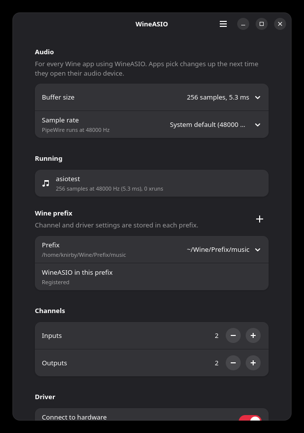

# wineasio-gui

A small settings app for [WineASIO](https://github.com/wineasio/wineasio) on Linux
systems that use PipeWire. It sets the buffer size and sample rate your Windows audio
apps get, edits WineASIO's settings in any Wine prefix, and shows which ASIO apps are
running and whether they are dropping out.

It comes with a command line version of everything, so you can script it or use it
over SSH.



## Why this exists

On a PipeWire system, WineASIO is a JACK client of PipeWire. That changes where the
important settings live:

- The **buffer size** is whatever PipeWire grants WineASIO's JACK client. The buffer
  slider in your DAW (FL Studio, Reaper, Ableton) has no say in it.
- The **sample rate** is PipeWire's graph rate. If your project wants 44.1 kHz and
  PipeWire runs at 48 kHz, the DAW complains that the ASIO driver doesn't support the
  rate.
- The **channel counts and driver options** live in each Wine prefix's registry.

wineasio-gui puts all three in one place and writes each to the right spot.

## Install

You need Python 3.10 or newer, PipeWire with its JACK library (`pipewire-jack`), and
WineASIO itself. The window also needs PyGObject with GTK 4 and libadwaita 1.4 or
newer. Without those, the command line version still works.

On Fedora:

```sh
sudo dnf install python3-gobject gtk4 libadwaita pipewire-jack-audio-connection-kit pipewire-utils
```

On Arch:

```sh
sudo pacman -S python-gobject gtk4 libadwaita pipewire-jack
```

On Debian or Ubuntu:

```sh
sudo apt install python3-gi gir1.2-gtk-4.0 gir1.2-adw-1 pipewire-jack pipewire-bin
```

Then, from a clone of this repository:

```sh
./install
```

That installs it for your user under `~/.local`. Use `sudo ./install --system` to
install it for everyone under `/usr/local`, and `./install --uninstall` to remove it.
You can also run `./wineasio-gui` straight from the clone without installing.

## Using the window

Open **WineASIO Settings** from your app menu, or run `wineasio-gui`.

The **Audio** section sets the buffer size and sample rate for every Wine app at once.
Smaller buffers mean lower latency and more CPU load. If you hear crackles, go one
step up. Changes apply the next time an app opens its audio device. In most DAWs you
can do that without restarting by picking WineASIO again in the audio settings.

**Running** lists the ASIO apps that have WineASIO open right now, with their buffer,
sample rate and xrun count. An xrun is a dropout. If the number keeps climbing while
you play, raise the buffer size.

**Wine prefix** picks which prefix the settings below apply to. Prefixes in the usual
places are found automatically. Use the plus button for one somewhere else. If
WineASIO isn't registered in a prefix yet, there's a button for that too.

**Channels** and **Driver** are WineASIO's own options for that prefix. They save as
soon as you change them, and apps pick them up when they next open the driver.

**System** checks three things that commonly break WineASIO: whether the driver is
installed for your Wine, whether programs get PipeWire's JACK library, and your memory
lock limit (more on that below).

## Using the command line

```sh
wineasio-gui status                  # buffer, sample rate and running ASIO apps
wineasio-gui buffer 128              # set the buffer for all Wine apps
wineasio-gui buffer default          # let PipeWire decide again
wineasio-gui rate 44100              # run PipeWire at 44.1 kHz
wineasio-gui rate default            # back to the system default
wineasio-gui prefixes                # list the prefixes it found
wineasio-gui show -p ~/.wine         # WineASIO settings of one prefix
wineasio-gui set -p ~/.wine inputs=2 outputs=2 connect=on
wineasio-gui register -p ~/.wine     # register WineASIO in a prefix
wineasio-gui add-prefix /path/to/prefix
wineasio-gui doctor                  # check driver, JACK library and memlock limit
```

Without `-p`, commands use `$WINEPREFIX`, then the prefix you used last, then `~/.wine`.
The keys for `set` are `inputs`, `outputs`, `preferred` (preferred buffer size), and
`connect`, `fixed` and `autostart`, which take `on` or `off`.

## Where settings are stored

The buffer size goes to `~/.config/pipewire/jack.conf.d/60-wineasio-gui.conf`. It is a
PipeWire rule that matches every JACK client running inside Wine, so it covers system
Wine, Proton builds, Bottles and Lutris alike.

The sample rate goes to `~/.config/pipewire/pipewire.conf.d/60-wineasio-gui-rate.conf`
and is also applied right away, so you don't need to restart PipeWire.

WineASIO's own options go to `HKEY_CURRENT_USER\Software\Wine\WineASIO` in the prefix.
If Wine is running in that prefix, wineasio-gui writes them through that same Wine.
If it isn't, it edits the prefix's `user.reg` directly. That way it never runs a
different Wine version against a Bottles or Lutris prefix. The first time it edits a
`user.reg`, it keeps a copy named `user.reg.bak-wineasio-gui`.

The prefixes you add by hand are remembered in `~/.config/wineasio-gui/config.json`.

## Troubleshooting

**The DAW freezes when you select WineASIO.** Stock WineASIO locks all of the host's
memory when it starts. With the usual 8 MiB memory lock limit, PipeWire then can't
start its own thread, and the driver waits forever. `wineasio-gui doctor` tells you if
your limit is small. There are two fixes. You can raise the limit: on Fedora, join the
`pipewire` group (`sudo usermod -aG pipewire $USER`, then log out and back in). Or you
can build WineASIO with `patches/wineasio-memlock.patch`, which only locks memory when
the limit is unlimited:

```sh
git clone https://github.com/wineasio/wineasio && cd wineasio
git apply /path/to/wineasio-gui/patches/wineasio-memlock.patch
make 64
```

The patched build is the better fix, because even a 4 GiB limit can run out in a big
session full of sample libraries.

**WineASIO doesn't show up in the DAW.** It isn't registered in that prefix. Use the
Register button, or `wineasio-gui register -p /path/to/prefix`. If that fails, the
driver isn't installed for the Wine that prefix uses; `wineasio-gui doctor` lists where
it was found.

**"The sample rate isn't supported by the ASIO driver."** WineASIO can only offer
PipeWire's current rate. Set the sample rate to the one your project uses.

**Settings seem to be ignored.** WineASIO prefers `WINEASIO_NUMBER_INPUTS` and its
other environment variables over the registry. The window shows a banner if any are
set, and `doctor` lists them.

## License

GPL-3.0-only. See [LICENSE](LICENSE).
